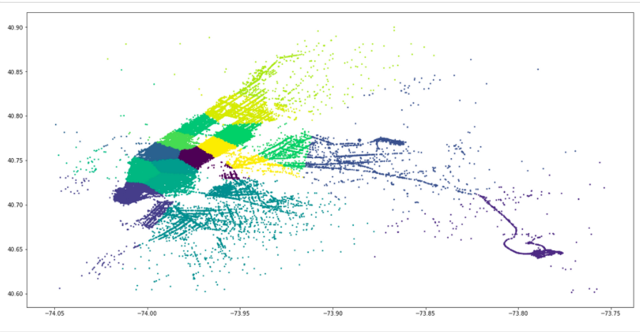

# Visualizations Of New York City Transportation

CS 398 Final Project in which we use Cloud Computing to quickly explore large datasets centered around the theme of NYC Transportation. Visualizations and analysis focus on Parking Tickets, Taxis and Citibikes.

### Prerequisites

To run the spark code in this project you need:
* Spark
* Spark SQL
* The datasets in csv files:
    * [Parking Ticket Dataset](https://data.cityofnewyork.us/City-Government/Parking-Violations-Issued-Fiscal-Year-2018/pvqr-7yc4)
    * [Centerline Streets of NYC](https://data.cityofnewyork.us/City-Government/NYC-Street-Centerline-CSCL-/exjm-f27b)
    * [Parking Meters](https://data.cityofnewyork.us/Transportation/Parking-Meters/5jsj-cq4s/about)
    * [Yellow Taxi](https://data.cityofnewyork.us/Transportation/2014-Yellow-Taxi-Trip-Data/gn7m-em8n)
    * [CitiBike Dataset](https://www.citibikenyc.com/system-data)

To run the visualizations in the jupyter notebook file you need:
* The files in the data folder
* The required packages:
  * Matplotlib
  * Pandas
  * numpy
  * mapsplotlib (the file located in this directory)

## Navigating the project

1. *Spark Transformation of parking ticket dataset:*
The spark files used to aggregate parking data and print output to .csv or .txt are all located in the "Parking Spark Files" directory. This directory contains four python files:
  * **SparkTimeSeriesParkingData.py** - this program will take as input a path to your parking ticket .csv file and then will ouput two .txt files. 
      * The first file will contain two lists, one is the integer value of the day of the week (1/Mon - 7/Sun). The second list are the respective values of parking tickets given on that day of the week.
      * The second output file will also have two lists, one is a set of 24 numbers for each hour of the day. And the second list contains the values of # of tickets for each hour.
  * **SparkMapTicketsToLocation.py** - this program will join a parking ticket dataset with the centerline dataset and aggregate parking tickets to street segments. The output is another csv file with geometric information about every street segement as well as the number of tickets given out on that street segment.
  * **SparkmapTicketsInGroups.py** - this program uses similar code to the previous file, but outputs segmented versions of the above output.
      * The first output is a set of 7 csv files which contain the same output as the previous file, but only with parking tickets on a specific day of the week (Mon. - Sun.)
      * The second output is a single csv file where the data is split by hour of the day. The output has four columns (geometry of street segment, # of ticket, hour of the day, AM/PM).
  * **SparkGetParkingMetersNearLocation.py** - finally, this python file takes input latitude and longitude that depict a users location in NYC. Then it outputs a csv file of parking meters in the general vicinity of the enter latitude and longitude with columns: meter number, latitude, and longitude.

  * **dataCleaningBikes.py** - this python file takes the massive initial dataset of bikedata and filters out all the unnesary values from the data as well as adds some new columns that make other operations far easier, doesnt include all the filtering as quite a bit of it is done initially locally using VBA.

  * **getLatitudes.py** - determines the latitudes of specific bike stations from their addresses using the centerline dataset, does require both datasets to line up though which is accomplish using the local cleaning as well as the previous file.

  * **makeSperateFiles.py** - this makes all the different relevlant files needed to peform indivual analysis and comparison among the bike data, whether that be morning - evening or the different seasons, allows for smaller easier to use datasets to be made.
    
  * **taxi_ml** - this folder contains all the machine learning files and some csv of output data. In addition there are ipynb files containing the cluster graph and the distance vs fare graph

  * **Misc.** - Since a lot of work was done using jupyter notebook and the spark shell for quick speed, several small snippets of code have not been included / lost. Examples of such snippets are the random generation of points for visualizations, 1 line filter arguments as well as the VBA macro used for the initial bike data cleaning/aggregation

1. *Visualizations of parking ticket data:* Visualizations of parking ticket data is located in the   **FinalProjectVisualizationsJupyterNotebook.ipynb** file. All required data that was output from spark files has been copied into this repository in the "data" directory so that the visualizations can be rerun in the notebook.


## Example Visualizations

**Scatter Plot of Parking tickets in NYC**


**Gif of Parking Tickets by Hour of the Day**


**Parking Ticket Heatmap**


**Taxi Morning Pickup and Dropoff Scatter Plot**


**Taxi Number of Trips per Month**


**Taxi Clustering Into Sections of NYC**


**CitiBike Heatmap of Nightime Usage**


### Running Spark Files

Each Spark file requires a specific set of arguments and certain csv data files.
Use --help to see the arguments

```
spark-submit SparkGetParkingMetersNearLocation.py --help
Output:
positional arguments:
  latitude              Latitude in NYC for center of search (suggest between
                        -74.016685 and -73.915438)
  longitude             Longitude in NYC for center of search (suggest between
                        40.703957 and 40.798414)

optional arguments:
  -h, --help            show this help message and exit
  --minimum_range MINIMUM_RANGE
                        The range in which the meters must be from the cetner
                        (in terms of lat and lon)
  --parking_file PARKING_FILE
                        File path to load parking ticket data from
  --parking_meters_file PARKING_METERS_FILE
                        File path to load parking meters data from
  --output_directory OUTPUT_DIRECTORY
                        File path for folder that will contain the multiple
                        parts of output csv
```

One example to start a program:

```
spark-submit SparkGetParkingMetersNearLocation.py -74.016685 -73.915438 --minimum_range 0.2 --parking_file hdfs:///path_to_csv.csv --output_directory outputs/meters_near_me
```

For any of the *.py files in taxi_ml:
```
spark-submit <PYTHON_FILENAME>.py path/to/taxi/data.csv
```
## Authors

* **Alexandre Geubelle**
* **Lawson Probasco**
* **David Raskin**
* **Anmol Nigam**

## Acknowledgments
* Checkout the github for [mapsplotlib](https://github.com/tcassou/mapsplotlib) which was used to create the visualization overtop the google maps.# CloudComputingNYCDataProject
